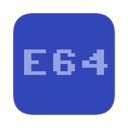
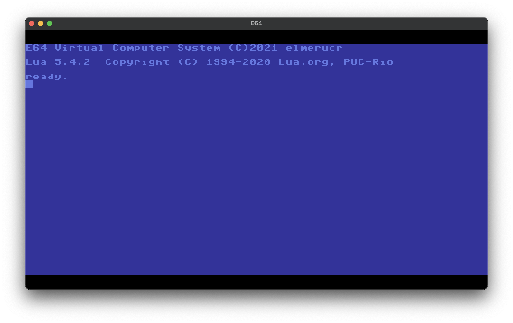
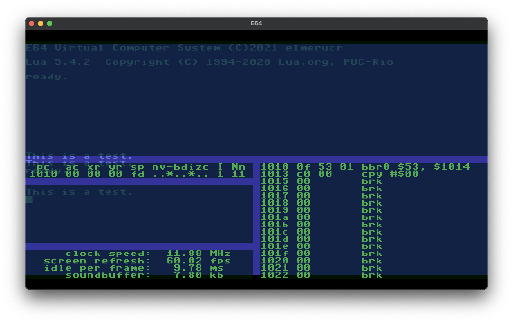

# E64

## Description
E64 is a virtual computer system that runs on macOS and linux. It's mainly inspired by the Commodore 64 and implements some Amiga 500 and Atari ST technology as well.
## Technical specifications:
* Main system with 64k ram.
* Custom Video Interface Chip (VICV) with a resolution of 512x288 pixels and a palette of 4096 colors (12bit).
* Custom Blitter Chip with alpha blending capabilities and 16mb video ram.
* Two SID chips (MOS 6581) with stereo mixing possibilities. Each individual SID chip runs at 985248Hz for the same pitch as the chips in the original C64 pal version. Emulation is achieved with the excellent [reSID](http://www.zimmers.net/anonftp/pub/cbm/crossplatform/emulators/resid/index.html) library by Dag Lem.
* Eight independent and programmable timers.
## Screenshots


## Compiling
### Core application
#### macOS
* Install [Xcode](https://developer.apple.com/xcode).
* Install the [SDL2 framework].(https://www.libsdl.org/download-2.0.php) development library to /Library/Frameworks
* Open the Xcode project in the ./macOS/E64-SQ folder and build the application.
#### Ubuntu Linux / Debian
Run the following commands in a terminal:
````console
$ sudo apt install build-essential cmake git libsdl2-dev
$ git clone https://github.com/elmerucr/E64
$ cd E64 && mkdir build && cd build
$ cmake ..
$ make
````
Finally, to run the application from the build directory:
````console
$ ./E64
````
## Websites and projects of interest
### Scripting Language
* [Lua](http://www.lua.org) - Lua is a powerful, efficient, lightweight, embeddable scripting language. It supports procedural programming, object-oriented programming, functional programming, data-driven programming, and data description.
### Emulators
* [CCS64](http://www.ccs64.com) - A Commodore 64 Emulator by Per Håkan Sundell.
* [Commander X16 emulator](https://github.com/commanderx16/x16-emulator) - Software version of Commander X16.
* [Hatari](https://hatari.tuxfamily.org) - Hatari is an Atari ST/STE/TT/Falcon emulator.
* [lib65ce02](https://github.com/elmerucr/lib65ce02) - CSG65CE02 emulator written in C.
* [Moira](https://github.com/dirkwhoffmann/Moira) - Motorola 68000 emulator written in C++ by Dirk W. Hoffmann.
* [Musashi](https://github.com/kstenerud/Musashi) - Motorola 680x0 emulator written in C by Karl Stenerud.
* [reSID](http://www.zimmers.net/anonftp/pub/cbm/crossplatform/emulators/resid/index.html) - ReSID is a Commodore 6581 or 8580 Sound Interface Device emulator by Dag Lem.
* [vAmiga](http://www.dirkwhoffmann.de/software/vamiga.html) - An Amiga 500, 1000, or 2000 on your Apple Macintosh by Dirk W. Hoffmann.
* [VICE](http://vice-emu.sourceforge.net) - The Versatile Commodore Emulator.
* [VirtualC64](http://www.dirkwhoffmann.de/software/virtualc64.html) - A Commodore 64 on your Apple Macintosh by Dirk W. Hoffmann.
### Other
* [C256 Foenix](https://c256foenix.com) - A computer that could have possibly followed the Commodore 128 if things would have been different at Commodore at the time.
* [Commander X16](https://www.commanderx16.com) - The Commander X16 is a modern 8-bit computer currently in active development. It is the brainchild of David "the 8 Bit Guy" Murray.
* [EmuTOS](https://emutos.sourceforge.io) - EmuTOS is a Free operating system for computers based on Motorola 680x0 or ColdFire microprocessors.
* [Mega65](http://mega65.org) - The 21st century realization of the C65 heritage.
* [SDL Simple DirectMedia Layer](https://www.libsdl.org) - A cross-platform development library by Sam Lantinga designed to provide low level access to audio, keyboard, mouse, joystick, and graphics hardware.
* [ultimate64](https://ultimate64.com/Ultimate-64) - A hardware implementation (FPGA) of the C64.
* [visual6502](http://www.visual6502.org) - Visual Transistor-level Simulation of the 6502 CPU and other chips.
## MIT License
Copyright (c) 2021 elmerucr

Permission is hereby granted, free of charge, to any person obtaining a copy of this software and associated documentation files (the "Software"), to deal in the Software without restriction, including without limitation the rights to use, copy, modify, merge, publish, distribute, sublicense, and/or sell copies of the Software, and to permit persons to whom the Software is furnished to do so, subject to the following conditions:

The above copyright notice and this permission notice shall be included in all copies or substantial portions of the Software.

THE SOFTWARE IS PROVIDED "AS IS", WITHOUT WARRANTY OF ANY KIND, EXPRESS OR IMPLIED, INCLUDING BUT NOT LIMITED TO THE WARRANTIES OF MERCHANTABILITY, FITNESS FOR A PARTICULAR PURPOSE AND NONINFRINGEMENT. IN NO EVENT SHALL THE AUTHORS OR COPYRIGHT HOLDERS BE LIABLE FOR ANY CLAIM, DAMAGES OR OTHER LIABILITY, WHETHER IN AN ACTION OF CONTRACT, TORT OR OTHERWISE, ARISING FROM, OUT OF OR IN CONNECTION WITH THE SOFTWARE OR THE USE OR OTHER DEALINGS IN THE
SOFTWARE.
